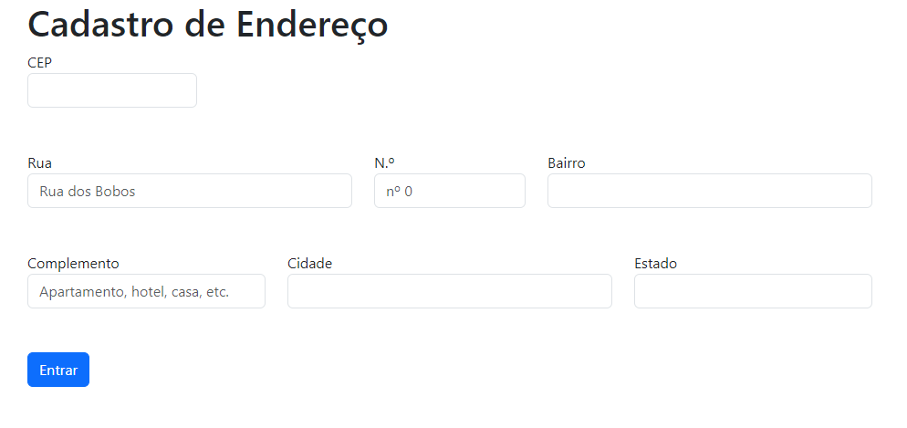

# form-CadEndereco

# Índice

[Cadastro de Endereço](#form-cadendereco)  
[Introdução](#introdu%C3%A7%C3%A3o)  
[Descrição](#descri%C3%A7%C3%A3o)  
[Tecnologias ultilizadas ](#tecnologias-utilizadas)  
[Funcionalidade](#funcionalidade)  
[Fontes consultadas ](#fontes-consultadas)   
[Autores](S#autores)  

# Cadastro de endereço 🔗

## Introdução 
Este é um formulario de cadastro de endereço simples, projetado para permitir que os usuários insiram informações de endereço de uma maneira fácil.

## Descrição
O formulário possui a acapacidade de preencher automaticamente informações com base no CEP fornecido, facilitando o processo de peenchimento.

## Tecnologias Utilizadas

A seguir, listamos as principais tecnologias utilizadas neste projeto:

| Tecnologia         | Descrição             |
|--------------------|-----------------------|
| VS Code (Visual Code) | Editor de código-fonte  |
| GitHub             | Plataforma de hospedagem de código |
| HTML               | Linguagem de marcação  |
| CSS                | Folhas de estilo em cascata |
| JSS                | Lib de estilo em JavaScript |

## Funcionalidade 

1- **Validação de CEP:** Ao sair do campo CEP, o sistema verifica se o CEP inserido contém exatamente 8 dígitos numéricos. Se o CEP estiver incorreto, uma mensagem de erro "CEP incorreto" será exibida, alertando o usuário sobre a entrada inválida.

2- **Limpar Formulário:** Uma função está disponível para limpar todos os campos do formulário, permitindo que o usuário comece novamente, se necessário.

3- **Integração com API Externa:** A aplicação se integra com a API da Via CEP para obter informações de endereço em tempo real com base no CEP fornecido pelo usuário. Isso garante que os dados sejam precisos e atualizados

4-**Preenchimento Automático de Endereço:** Quando o usuário insere um CEP válido e sai do campo CEP, o sistema consulta a API da Via CEP para recuperar automaticamente as informações de rua, bairro, cidade e estado correspondentes ao CEP. Isso economiza tempo e evita erros de digitação.

## Fontes consultadas 

## Autores 
Veronica Borges
